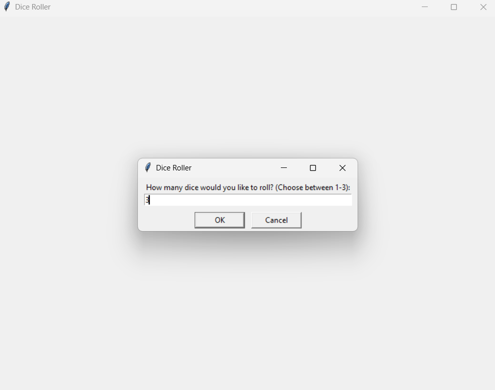
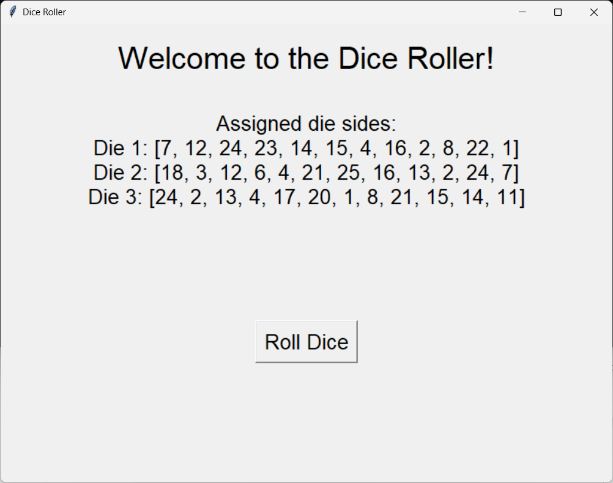
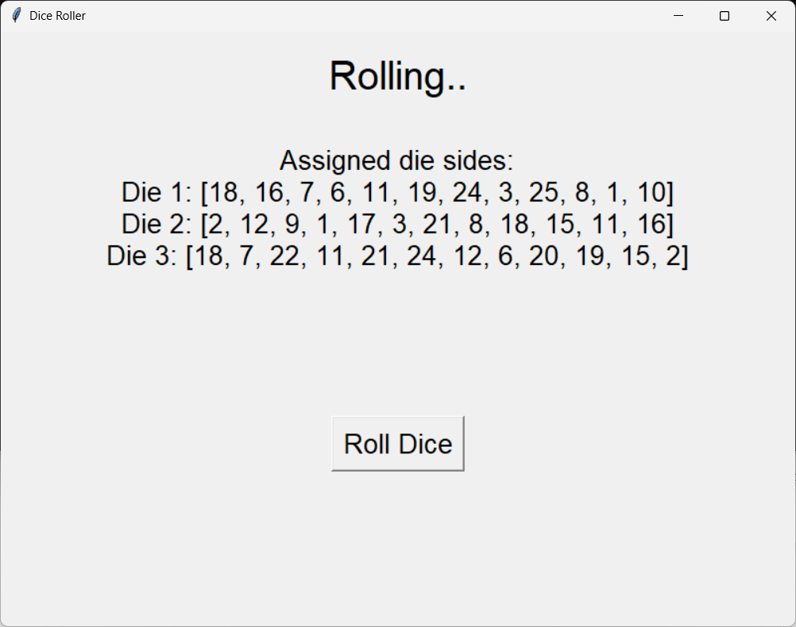
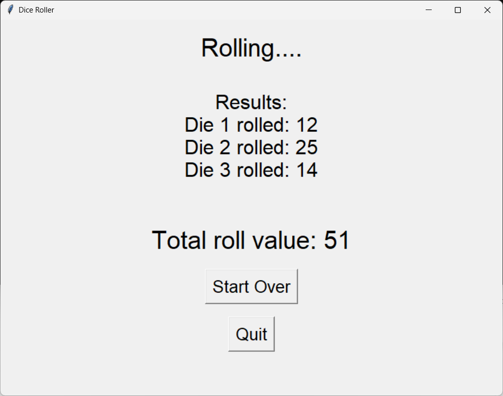

<div align="center">

# 🎲 Graphical Dice Roller

**An interactive dice roller with a visually appealing Tkinter GUI.** 🎨

Roll 1 to 3 dice, each with unique numbered sides, and watch the results roll in.

<table>
  <tr>
    <td align="center"></td>
    <td width="20"></td>
    <td align="center"></td>
  </tr>
  <tr><td colspan="3" height="20"></td></tr>
  <tr>
    <td align="center"></td>
    <td width="20"></td>
    <td align="center"></td>
  </tr>
</table>

</div>

---

## ✨ Features

| | |
|---|---|
| 🎯 **Customizable Dice Rolls** | Choose between 1 to 3 dice to roll |
| 🔢 **Unique Sides** | Each die has 12 unique sides numbered from 1 to 25 |
| 🌀 **Rolling Animation** | Simulates the dice rolling process visually (needs improvement) |
| 📊 **Result Display** | Shows individual dice rolls and the total value |
| 🔁 **Restart or Quit** | Easily restart the application or exit after rolling |

---

## 🚀 Getting Started

### Prerequisites

1. **Install Python** 🐍
   - Download Python from [python.org](https://www.python.org/downloads/)
   - During installation, check the box to **"Add Python to PATH"**
   - Verify installation:
     ```bash
     python --version
     pip --version
     ```

2. **Install Required Libraries**
   - This script uses Python's built-in `tkinter` library — no additional installations needed ✅

### Installation & Run

1. **Download or clone the script**
   Save the `dice_roller.py` file to your desired directory.

2. **Run it**
   ```bash
   python dice_roller.py
   ```

3. **Interact with the app** 🎉
   - A GUI window will open, welcoming you to the Dice Roller
   - Choose how many dice to roll (1 to 3)
   - View the unique sides assigned to each die
   - Click **Roll Dice** to see the rolling animation and results
   - After rolling, restart or quit the application

---

## 📝 Notes

- 🪟 This script uses the Tkinter library for GUI interactions; ensure your Python installation supports it
- 🖥️ For best results, use a system with a screen resolution that supports the application's default window size (800x600)

---

## 💡 Example Use Case

Use this script as a fun and interactive way to simulate dice rolls for games or educational purposes. It can be extended to support different dice configurations or integrated into larger projects.

---

<div align="center">

Feel free to contribute or suggest improvements! 🙌

</div>
